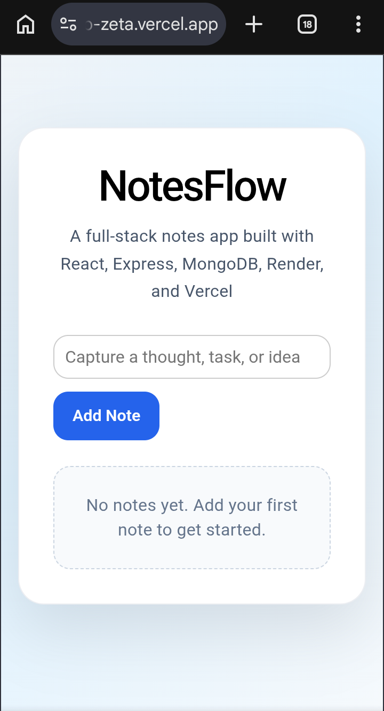
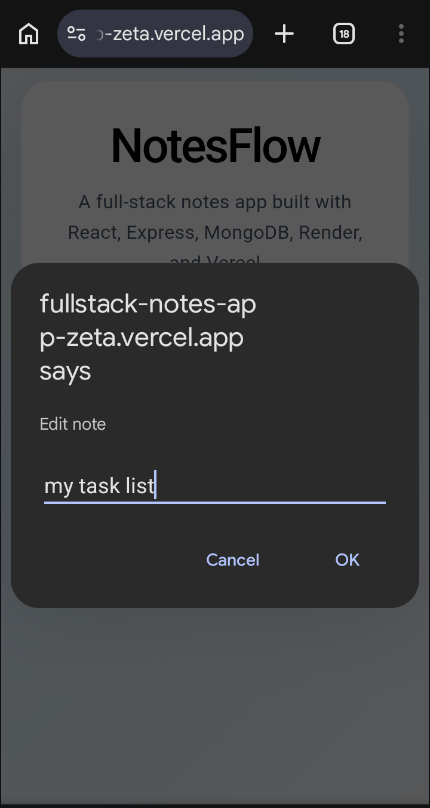

# NotesFlow - Full Stack Notes App

NotesFlow is a full-stack CRUD notes application for creating, updating, and managing notes through a clean React interface backed by an Express API and MongoDB database.

## Live Demo

- Frontend: [Live App](https://fullstack-notes-app-zeta.vercel.app/)
- Backend: [API](https://notes-backend-jyre.onrender.com/)

## Features

- Create new notes instantly
- Edit existing notes
- Delete notes
- Persist note data in MongoDB Atlas
- Responsive, clean UI for desktop and mobile

## Tech Stack

- Frontend: React, Vite
- Backend: Node.js, Express
- Database: MongoDB Atlas
- Deployment: Vercel, Render

## Screenshots

<p align="center">
  
  
  
</p>

## Project Structure

```text
fullstack-app/
|- backend/
|  |- server.js
|  |- package.json
|- frontend/
|  |- src/
|  |- package.json
|- README.md
```

## Local Setup

1. Clone the repository.

```bash
git clone <your-repo-url>
cd fullstack-app
```

2. Install backend dependencies.

```bash
cd backend
npm install
```

3. Create a `.env` file in `backend/` and add your MongoDB connection string.

```env
MONGO_URI=your_mongodb_atlas_connection_string
```

4. Start the backend server.

```bash
npm start
```

5. Install frontend dependencies.

```bash
cd ../frontend
npm install
```

6. Start the frontend development server.

```bash
npm run dev
```

## API Endpoints

- `GET /api/notes`
- `POST /api/notes`
- `PUT /api/notes/:id`
- `DELETE /api/notes/:id`

## Author

Ryan Abir
